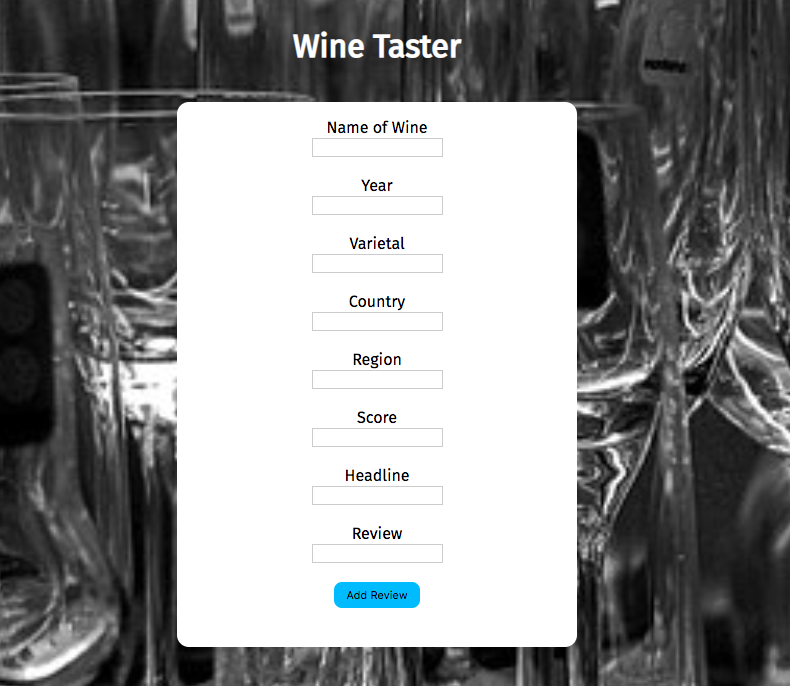
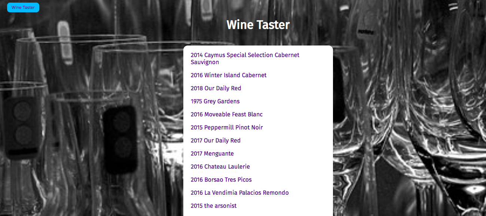

Winetaster

A social site for reviewing wines

Motivation:
I wanted to create a site to start to get people interested in understanding wine, with the first step being an opportunity to record their own reviews of wines and learn from reading others' reviews. 

Repo: https://github.com/mcgrathprj/winetaster

Built In: JavaScript, jQuery, Node, CSS, HTML

Screens: 

